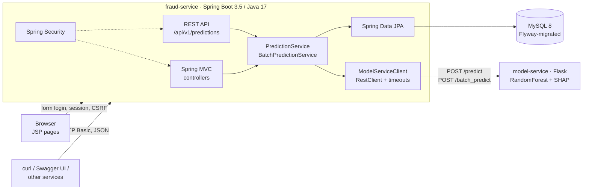

# Fraud Detection System

[](https://github.com/YueCai335/fraud-detection-system/actions/workflows/ci.yml)

Scores PaySim-style mobile-money transactions for fraud, one at a time or from a CSV, and explains
each flagged transaction with its top-3 SHAP features.

It started as a Java EE course project (JSP/Servlets → JAX-WS SOAP → Flask) and was then migrated
to a **Spring Boot REST service + Python model microservice**, keeping the trained model and the
UI while replacing the SOAP/JDBC middle tier. The before/after is written up in
[docs/migration.md](docs/migration.md).

## Architecture



| Component | Tech | Responsibility |
|---|---|---|
| [`fraud-service/`](fraud-service/) | Spring Boot 3.5, Spring MVC + JSP, Spring Data JPA/Hibernate, Flyway, Spring Security, springdoc-openapi, JUnit 5/Mockito/MockMvc | Web UI, REST API, users & prediction history, orchestration of the model call |
| [`model-service/`](model-service/) | Python 3.10, Flask, scikit-learn 1.7, SHAP, gunicorn, pytest | Loads the pickled RandomForest and scores feature vectors |
| [`notebooks/`](notebooks/) | Jupyter | Data preparation, model comparison (DT / RF / KNN) and training |
| `docker-compose.yml` | MySQL 8.4 + the two services | One-command local environment |
| `.github/workflows/ci.yml` | GitHub Actions | pytest, Maven verify, then a compose-based end-to-end smoke test |

## Quick start

Prerequisites: Docker Desktop. (JDK 17 and Python 3.10 only if you want to run the services outside Docker.)

```bash
docker compose up --build
```

Once all three containers report healthy:

| What | URL |
|---|---|
| Web UI | http://localhost:8080 — demo account **demo / demo123**, or register your own |
| Swagger UI | http://localhost:8080/swagger-ui.html (click *Authorize*, HTTP Basic) |
| OpenAPI JSON | http://localhost:8080/v3/api-docs |
| Health (incl. DB and model-service) | http://localhost:8080/actuator/health |
| Model service | http://localhost:5001/health (host port 5001; macOS AirPlay often holds 5000) |

## REST API

All endpoints require HTTP Basic auth with a registered user.

```bash
# score one transaction
curl -u demo:demo123 -H 'Content-Type: application/json' localhost:8080/api/v1/predictions \
  -d '{"step":100,"typeCode":1,"amount":10000,"oldbalanceOrg":10000,"newbalanceOrig":0,"oldbalanceDest":0,"newbalanceDest":10000}'
```

```json
{
  "id": 1, "step": 100, "typeCode": 1, "type": "CASH_OUT", "amount": 10000.0, "...": "...",
  "fraud": true, "probFraud": 0.39, "threshold": 0.25,
  "reasons": ["Receiver balance after transaction changed significantly",
              "High-risk transaction type (CASH_OUT)",
              "Receiver balance before transaction looks unusual"],
  "createdAt": "2026-09-15T06:03:50Z"
}
```

```bash
# score a CSV (header optional; columns step,type_code,amount,oldbalanceOrg,newbalanceOrig,oldbalanceDest,newbalanceDest)
curl -u demo:demo123 -F file=@fraud-service/src/main/resources/static/samples/sample_transactions.csv \
  localhost:8080/api/v1/predictions/batch

# download that batch again as CSV
curl -u demo:demo123 localhost:8080/api/v1/predictions/batches/<batchId>/csv

# my history, newest first
curl -u demo:demo123 'localhost:8080/api/v1/predictions?page=0&size=20'
```

Errors are RFC 9457 problem details: `400` with a per-field `errors` map for validation,
`503` when the model service is down or times out, `404` for someone else's batch.

`type_code` mapping: `0 CASH_IN · 1 CASH_OUT · 2 DEBIT · 3 PAYMENT · 4 TRANSFER`.

## Development

### fraud-service

```bash
cd fraud-service
./mvnw verify                      # unit + MockMvc tests on in-memory H2 (no Docker needed)
./mvnw spring-boot:run             # needs MySQL on :3306 and model-service on :5000 (see application.yml)
```

Configuration is via environment variables: `DB_URL`, `DB_USER`, `DB_PASSWORD`, `MODEL_SERVICE_URL`, `SERVER_PORT`.
Schema changes go in `src/main/resources/db/migration/V<n>__<name>.sql`; Hibernate runs in `validate` mode.

### model-service

```bash
cd model-service
python3 -m venv .venv && source .venv/bin/activate
pip install -r requirements-dev.txt
pytest
python app.py                      # http://localhost:5000
```

See [model-service/README.md](model-service/README.md) for the endpoint contract.

## Project layout

```
.
├── docker-compose.yml
├── .github/workflows/ci.yml
├── docs/                      migration write-up, original course proposal
├── fraud-service/             Spring Boot (REST + JSP UI + JPA + Security)
│   ├── src/main/java/com/yuecai/fraud/
│   │   ├── api/               REST controllers, problem-detail handler
│   │   ├── web/               MVC controllers for the JSP pages
│   │   ├── prediction/        domain: entity, repository, services, CSV parsing
│   │   ├── user/              entity, repository, registration, UserDetailsService
│   │   ├── modelclient/       RestClient wrapper for model-service + health indicator
│   │   └── config/            Security, OpenAPI, RestClient beans
│   ├── src/main/resources/db/migration/   Flyway
│   ├── src/main/webapp/WEB-INF/views/     JSP pages
│   └── src/test/java/         JUnit 5, Mockito, MockRestServiceServer, MockMvc
├── model-service/             Flask + scikit-learn + SHAP, Dockerfile, pytest
└── notebooks/                 training notebook and feature list
```

## Model

RandomForest (100 trees, `class_weight="balanced"`) trained on a 70k-row prototype sample of the
[PaySim dataset](https://www.kaggle.com/datasets/ealaxi/paysim1): all 8,213 fraud rows plus 61,787
randomly sampled non-fraud rows, so the prototype set is ~11.7% fraud versus ~0.13% in the full
dataset. Features: the seven raw columns plus two engineered ones,
`balanceDiffOrg = oldbalanceOrg − newbalanceOrig` and `balanceDiffDest = newbalanceDest − oldbalanceDest`.

Reported metrics come from a stratified random 80/20 split of that prototype set (14,000 test rows,
1,643 fraud), scored with scikit-learn's default `predict()` (0.5 threshold): precision 0.980,
recall 0.992 on the fraud class (confusion matrix `[[12324, 33], [14, 1629]]`). These numbers do not
describe performance at the real transaction mix — with ~90× fewer fraud cases per honest transaction,
the same model would produce far more false positives per true fraud. The exported model was then
retrained on the full prototype set, so its exact test-set numbers are not measured separately.

The serving threshold defaults to 0.25 (`FRAUD_THRESHOLD`). This is a demo configuration, not a
validated choice: no threshold sweep or separate validation set was used to select it. The
prototype has not been evaluated with a time-based split (PaySim `step`), which is what a
post-transaction monitoring scenario would require. This is a course-project prototype, not a
production fraud model.
