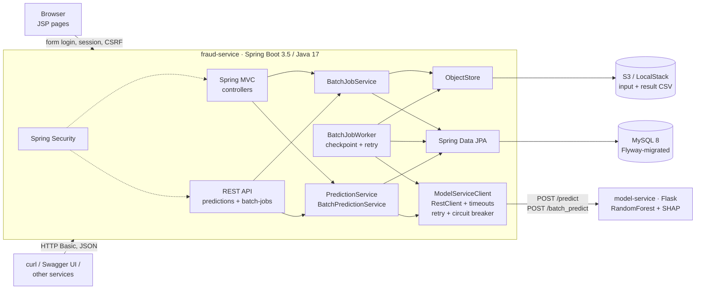
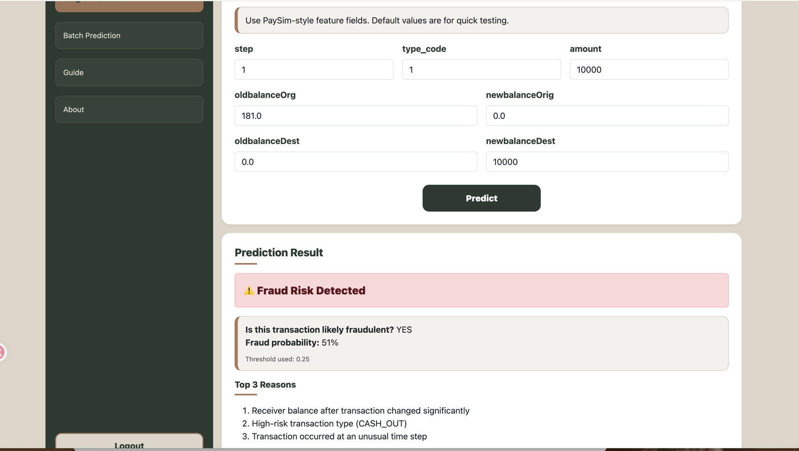
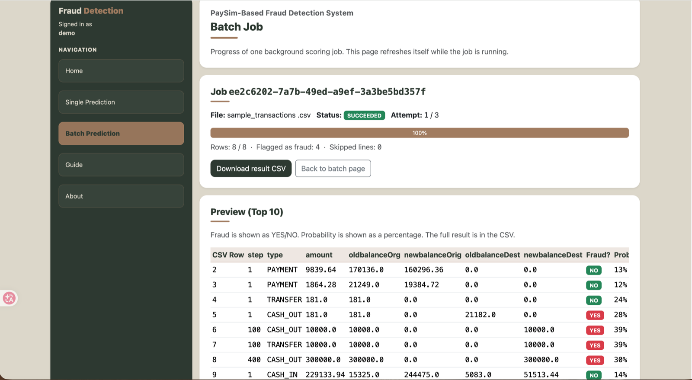

# Fraud Detection System

[](https://github.com/YueCai335/fraud-detection-system/actions/workflows/ci.yml)

Scores PaySim-style mobile-money transactions for fraud and explains each flagged transaction
with its top-3 SHAP features. CSV scoring supports asynchronous jobs with progress tracking,
checkpoint recovery, and result downloads from S3 (LocalStack locally).

It started as a Java EE course project (JSP/Servlets → JAX-WS SOAP → Flask) and was then migrated
to a **Spring Boot REST service + Python model microservice**, keeping the trained model and the
UI while replacing the SOAP/JDBC middle tier. The before/after is written up in
[docs/migration.md](docs/migration.md).

## Architecture



| Component | Tech | Responsibility |
|---|---|---|
| [`fraud-service/`](fraud-service/) | Spring Boot 3.5, Spring MVC + JSP, Spring Data JPA/Hibernate, Flyway, Spring Security, Resilience4j, AWS SDK (S3), springdoc-openapi, JUnit 5/Mockito/MockMvc | Web UI, REST API, users & prediction history, async batch jobs, orchestration of the model call |
| [`model-service/`](model-service/) | Python 3.10, Flask, scikit-learn 1.7, SHAP, gunicorn, pytest | Loads the pickled RandomForest and scores feature vectors |
| [`notebooks/`](notebooks/) | Jupyter | Data preparation, model comparison (DT / RF / KNN) and training |
| `docker-compose.yml` | MySQL 8.4 + LocalStack (S3) + the two services | One-command local environment |
| [`infra/`](infra/) | Terraform | On-demand AWS environment: VPC, ECR, ECS Fargate, RDS, S3, IAM (OIDC deploy role and scoped task role) |
| `.github/workflows/ci.yml` | GitHub Actions | pytest, Maven verify, then a compose-based end-to-end smoke test |
| `.github/workflows/deploy.yml` | GitHub Actions | Manual: build linux/amd64 images, push to ECR by commit SHA, roll the ECS service |

## Quick start

Prerequisites: Docker Desktop. (JDK 17 and Python 3.10 only if you want to run the services outside Docker.)

```bash
docker compose up --build
```

Once all four services report healthy:

| What | URL |
|---|---|
| Web UI | http://localhost:8080 — demo account **demo / demo123** (seeded by the `demo` Spring profile, which compose enables), or register your own |
| Swagger UI | http://localhost:8080/swagger-ui.html (click *Authorize*, HTTP Basic) |
| OpenAPI JSON | http://localhost:8080/v3/api-docs |
| Health (incl. DB and model-service) | http://localhost:8080/actuator/health |
| Model service | http://localhost:5001/health (host port 5001; macOS AirPlay often holds 5000) |

## Deployment (AWS, on demand)

The same application containers run on **AWS ECS Fargate + RDS MySQL**, with **S3** storing
batch input and result files, provisioned with Terraform
([`infra/`](infra/)) and deployed by a GitHub Actions workflow through an OIDC role (no stored
keys). The environment is created for verification and demo sessions and destroyed afterwards —
there is no always-on URL; run it locally with `docker compose up` or see
[docs/deployment.md](docs/deployment.md) for what was verified on AWS and when.

| Single prediction on AWS | Async batch job on AWS (S3-backed) |
|---|---|
|  |  |

## REST API

All endpoints require HTTP Basic auth with a registered user.

```bash
# score one transaction
curl -u demo:demo123 -H 'Content-Type: application/json' localhost:8080/api/v1/predictions \
  -d '{"step":100,"typeCode":1,"amount":10000,"oldbalanceOrg":10000,"newbalanceOrig":0,"oldbalanceDest":0,"newbalanceDest":10000}'
```

```json
{
  "id": 1, "step": 100, "typeCode": 1, "type": "CASH_OUT", "amount": 10000.0, "...": "...",
  "fraud": true, "probFraud": 0.39, "threshold": 0.25,
  "reasons": ["Receiver balance after transaction changed significantly",
              "High-risk transaction type (CASH_OUT)",
              "Receiver balance before transaction looks unusual"],
  "createdAt": "2026-09-15T06:03:50Z"
}
```

```bash
# score a CSV (header optional; columns step,type_code,amount,oldbalanceOrg,newbalanceOrig,oldbalanceDest,newbalanceDest)
curl -u demo:demo123 -F file=@fraud-service/src/main/resources/static/samples/sample_transactions.csv \
  localhost:8080/api/v1/predictions/batch

# download that batch again as CSV
curl -u demo:demo123 localhost:8080/api/v1/predictions/batches/<batchId>/csv

# my history, newest first
curl -u demo:demo123 'localhost:8080/api/v1/predictions?page=0&size=20'
```

### Asynchronous batch jobs

Submit a CSV job to track processing progress and download the result when it completes.
The default upload/request limit is 5 MB, and the worker accepts up to 100,000 valid rows:

```bash
# A new job returns 202 + Location; a matching existing submission returns 200.
# Idempotency-Key identifies the submission (the file's SHA-256 is used when omitted).
curl -u demo:demo123 -H 'Idempotency-Key: run-42' -F file=@transactions.csv localhost:8080/api/v1/batch-jobs
# poll: status PENDING/RUNNING/SUCCEEDED/FAILED, processedRows/totalRows, fraudCount, attempts, lastError
curl -u demo:demo123 localhost:8080/api/v1/batch-jobs/<id>
# result: 302 to a 15-minute S3 pre-signed URL (curl -L follows it)
curl -L -u demo:demo123 localhost:8080/api/v1/batch-jobs/<id>/result -o result.csv
# re-queue a FAILED job; it resumes from its last committed chunk
curl -X POST -u demo:demo123 localhost:8080/api/v1/batch-jobs/<id>/retry
```

How it works: the CSV goes to object storage (S3; LocalStack in docker compose), a `batch_jobs` row is
created, and an in-process worker claims PENDING rows with `SELECT … FOR UPDATE SKIP LOCKED` — the
database stores the queue. Rows are scored in chunks of 500; each chunk is committed together
with the job's `processed_rows` checkpoint. After an interrupted attempt, committed rows remain
saved and a retry resumes at the next uncommitted chunk. Model calls are retried
with back-off behind a circuit breaker (Resilience4j); a job gives up after 3 attempts and can be
retried manually. Jobs whose worker stops heart-beating are reclaimed automatically.

CSV rows use the same Bean Validation constraints as single-transaction requests; invalid rows
are skipped and reported. In AWS, S3 keeps job files private and encrypted, with a seven-day
lifecycle expiration. Result download URLs expire after 15 minutes.

Errors are RFC 9457 problem details: `400` with a per-field `errors` map for validation,
`503` when the model service is down or times out, `404` for someone else's batch.

`type_code` mapping: `0 CASH_IN · 1 CASH_OUT · 2 DEBIT · 3 PAYMENT · 4 TRANSFER`.

## Development

### fraud-service

```bash
cd fraud-service
./mvnw verify                      # unit + MockMvc tests on in-memory H2 (no Docker needed)
./mvnw spring-boot:run             # needs MySQL on :3306 and model-service on :5000 (see application.yml)
```

`SPRING_PROFILES_ACTIVE=demo` seeds the `demo` user and a few sample predictions (idempotent, see
`DemoDataSeeder`); without it a fresh database has no accounts — register one. After any change to the
stack, `scripts/smoke.sh http://localhost:8080 demo demo123` proves the Java → Python → MySQL chain
end to end; CI runs the same script against docker compose.

Configuration is via environment variables: `DB_URL`, `DB_USER`, `DB_PASSWORD`, `MODEL_SERVICE_URL`, `SERVER_PORT`.
Schema changes go in `src/main/resources/db/migration/V<n>__<name>.sql`; Hibernate runs in `validate` mode.

### model-service

```bash
cd model-service
python3 -m venv .venv && source .venv/bin/activate
pip install -r requirements-dev.txt
pytest
python app.py                      # http://localhost:5000
```

See [model-service/README.md](model-service/README.md) for the endpoint contract.

## Project layout

```
.
├── docker-compose.yml
├── .github/workflows/         ci.yml (tests) · deploy.yml (manual AWS deploy)
├── infra/                     Terraform: bootstrap (state bucket) · env (VPC, ECR, ECS, RDS, S3, IAM)
├── scripts/smoke.sh           end-to-end check used by CI, local verification and AWS deploys
├── docs/                      migration write-up, deployment log, course proposal
├── fraud-service/             Spring Boot (REST + JSP UI + JPA + Security)
│   ├── src/main/java/com/yuecai/fraud/
│   │   ├── api/               REST controllers, problem-detail handler
│   │   ├── web/               MVC controllers for the JSP pages
│   │   ├── prediction/        domain: entity, repository, services, CSV parsing
│   │   ├── batch/             async jobs: entity/state machine, DB-queue worker, service
│   │   ├── storage/           ObjectStore: S3 (and LocalStack) or in-memory
│   │   ├── user/              entity, repository, registration, UserDetailsService
│   │   ├── modelclient/       RestClient wrapper for model-service + health indicator
│   │   └── config/            Security, OpenAPI, RestClient beans
│   ├── src/main/resources/db/migration/   Flyway
│   ├── src/main/webapp/WEB-INF/views/     JSP pages
│   └── src/test/java/         JUnit 5, Mockito, MockRestServiceServer, MockMvc
├── model-service/             Flask + scikit-learn + SHAP, Dockerfile, pytest
└── notebooks/                 training notebook and feature list
```

## Model

RandomForest (100 trees, `class_weight="balanced"`) trained on a 70k-row prototype sample of the
[PaySim dataset](https://www.kaggle.com/datasets/ealaxi/paysim1): all 8,213 fraud rows plus 61,787
randomly sampled non-fraud rows, so the prototype set is ~11.7% fraud versus ~0.13% in the full
dataset. Features: the seven raw columns plus two engineered ones,
`balanceDiffOrg = oldbalanceOrg − newbalanceOrig` and `balanceDiffDest = newbalanceDest − oldbalanceDest`.

Reported metrics come from a stratified random 80/20 split of that prototype set (14,000 test rows,
1,643 fraud), scored with scikit-learn's default `predict()` (0.5 threshold): precision 0.980,
recall 0.992 on the fraud class (confusion matrix `[[12324, 33], [14, 1629]]`). These numbers do not
describe performance at the real transaction mix — with ~90× fewer fraud cases per honest transaction,
the same model would produce far more false positives per true fraud. The exported model was then
retrained on the full prototype set, so its exact test-set numbers are not measured separately.

The serving threshold defaults to 0.25 (`FRAUD_THRESHOLD`). This is a demo configuration, not a
validated choice: no threshold sweep or separate validation set was used to select it. The
prototype has not been evaluated with a time-based split (PaySim `step`), which is what a
post-transaction monitoring scenario would require. This is a course-project prototype, not a
production fraud model.
