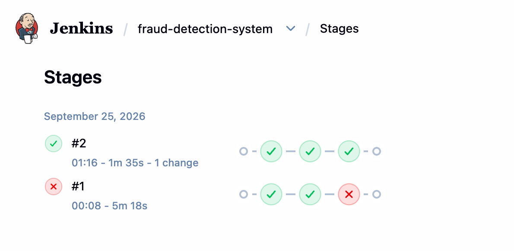

# The same pipeline on Jenkins

[`.github/workflows/ci.yml`](../.github/workflows/ci.yml) already runs three jobs on GitHub
Actions. [`Jenkinsfile`](../Jenkinsfile) runs the same three checks on a Jenkins controller that
runs on a laptop, so the two platforms can be compared on identical work rather than on toy jobs.



Build #1 (5 min 18 s) failed on the third stage; build #2 (1 min 35 s, warm image cache) is green.
What went wrong in between is written up under [The 403](#the-403-a-container-called-itself).

## Running the controller

```bash
docker compose -f ci/jenkins/compose.yml up -d --build
```

UI on <http://localhost:8081> — port 8081 because the app itself takes 8080.

[`ci/jenkins/Dockerfile`](../ci/jenkins/Dockerfile) adds the Docker CLI and the Compose plugin on
top of `jenkins/jenkins:lts-jdk17`; the official image has neither, and the pipeline needs both.
The compose file mounts the host's `/var/run/docker.sock`, so every container the build starts is a
**sibling** of the Jenkins container, started by the host's daemon. Nothing runs Docker-in-Docker.

Two things have to exist in Jenkins itself (they live in `jenkins_home`, not in this repo):

| What | Where | Value |
|---|---|---|
| The job | New Item → Pipeline → *Pipeline script from SCM* → this repo, `Jenkinsfile` | branch `main` |
| The credential | Manage Jenkins → Credentials → System → Global → *Username with password* | ID **`smoke-login`**, `demo` / `demo123` |

The credential ID is not cosmetic: `Jenkinsfile` looks the credential up by that exact string.

## The three stages

| Stage | Runs in | What it proves |
|---|---|---|
| `model-service (pytest)` | `python:3.10-slim` container | the Flask model service's 8 unit tests |
| `fraud-service (JUnit)` | `maven:3.9-eclipse-temurin-17` container | `mvn verify` — 48 JUnit 5 / MockMvc tests against H2, results published to Jenkins via the `junit` step |
| `docker compose smoke test` | the controller itself | the whole stack end to end: [`scripts/smoke.sh`](../scripts/smoke.sh) logs in, scores a transaction, reads it back from MySQL, scores a CSV batch, then submits an async job and downloads its result from the object store |

The third stage is the odd one out on purpose. The first two get a throwaway container each
(`agent { docker { image ... } }`), so the build tools never have to be installed on the
controller. The smoke test cannot work that way — it *drives* Docker (compose up, compose down),
so it runs on the controller, which is where the Docker CLI lives.

Two settings keep that stage from colliding with a developer's own stack on the same machine:
`COMPOSE_PROJECT_NAME=fraud-ci` gives the CI containers their own names and volumes, so the
`docker compose down -v` in `post` cannot wipe the MySQL volume of a stack someone is using.

## The 403: a container called itself

Build #1: both test stages green, all four containers reported healthy, then the smoke test died
on its first HTTP call.

```
+ scripts/smoke.sh http://localhost:8080 demo ****
curl: (22) The requested URL returned error: 403
  FAIL health endpoint unreachable
```

403, not "connection refused" — something *was* listening and refused the request. From inside the
Jenkins container:

```
$ curl -sI http://localhost:8080/
Server: Jetty(12.1.5)
X-Jenkins: 2.541.3
```

`localhost` inside a container means that container. The smoke test runs inside the Jenkins
container, Jenkins listens on 8080 internally (8081 is only the published port on the host), so
the script had been authenticating against the Jenkins UI, which quite correctly refused it.

On a GitHub Actions runner the same line works, because the job and the service containers share
one host and the published ports really are on `localhost`. Jenkins adds one level of containment,
and that is the whole difference.

The fix ([`169a737`](../Jenkinsfile)) is one variable:

```groovy
CI_HOST = 'host.docker.internal'   // the Docker Desktop host, as seen from inside a container
```

used for the smoke test's base URL and, through [`ci/compose.ci.yml`](../ci/compose.ci.yml), for
`STORAGE_PUBLIC_ENDPOINT` — the host that fraud-service writes into the pre-signed download URL it
hands back. Step 5 of the smoke test follows that URL, and the client following it is the same
curl inside the Jenkins container, so it had to be reachable from there too. Missing that second
one would have produced the identical failure three checks later.

## Jenkins vs GitHub Actions on this repo

| | GitHub Actions | Jenkins |
|---|---|---|
| Where it runs | a hosted runner per job, discarded after the run | a controller you install, keep and upgrade yourself |
| Machine model | `runs-on: ubuntu-latest`; tools come from `setup-python` / `setup-java` actions | `agent { docker { image ... } }` per stage; the image *is* the toolchain |
| Isolation | every job starts clean | the controller is long-lived — workspaces, caches and stray containers persist between builds |
| Network | the runner is the host: published ports are on `localhost` | the controller is a container: the host is `host.docker.internal` |
| Secrets | repository secrets injected as env vars by the workflow | credential store in `jenkins_home`, bound per block with `withCredentials`; Jenkins masks the value in the log (`demo ****`) |
| Test results | `upload-artifact` leaves a zip to download | the `junit` step parses the surefire XML, so Jenkins tracks pass/fail counts and trends across builds |
| Triggers | `on: push` / `pull_request` out of the box | polling, a webhook, or a manual build — configured on the job, not in the file |
| Caching | `cache: pip` / `cache: maven` in the setup actions | nothing by default; build #1 took 5 min 18 s, build #2 1 min 35 s once the images were local |

The honest summary: the YAML and the Groovy are not the interesting part — they say the same
thing. What differs is the environment each platform hands you, and the smoke-test stage is where
that showed up.
